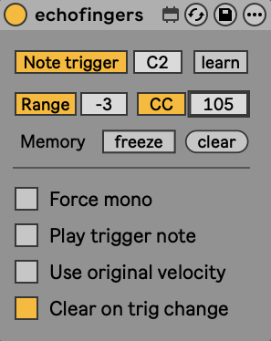

# EchoFingers

EchoFingers is a Max for Live MIDI performance device. It captures your physical keyboard input to memorize chords or single notes, allowing you to retrigger them infinitely using a designated trigger key, a key range, or a MIDI CC pedal.

Inspired by the "Neat Repeat" script for Logic Pro by Adam Adams.

## Features

* **Polyphonic Chord Memory:** Smart legato detection automatically stacks notes to build chords.
* **Trigger Range & Note:** Assign a single key or a complete key range to retrigger the memory.
* **CC Pedal Retrigger:** Use a sustain pedal (CC 64) or any other continuous controller to trigger the chord (always outputs your original playing velocity).
* **Force Mono Mode:** Memory only stores the very last note played, preventing unwanted chord stacking (ideal for hi-hats or fast arpeggios).
* **Memory Freeze (Lock):** Freeze the memory to solo over the rest of the keyboard without overwriting your trigger chord.
* **Original Velocity:** Replay the chord with the exact dynamics of your original performance instead of the trigger key's velocity.
* **Note Trigger Enable:** Disable key triggers entirely to use your full keyboard, triggering memory exclusively via your CC pedal.
* **Clear On Change:** Keep your chord memory intact even if you transpose your trigger zone mid-performance.

## Manual

1. **Learn:** Turn on the `Learn` toggle and press the key you want to use as your trigger.
2. **Play:** Play any chord or note on your keyboard. 
3. **Retrigger:** Release the chord, then press your Trigger key (or CC pedal) to play it back.
4. **Perform:** Toggle `Memory Freeze` to lock the chord in place, allowing you to play freely over it with your remaining keys.

## License & Support

Licensed under **CC BY-NC-SA 4.0**. You are free to use, modify, and share this device for non-commercial purposes, provided you credit the original author and share your modifications under the same license.

EchoFingers is completely free. If it improves your workflow, consider supporting the creator:
[Support Buma on Ko-fi](https://ko-fi.com/bumathan)
